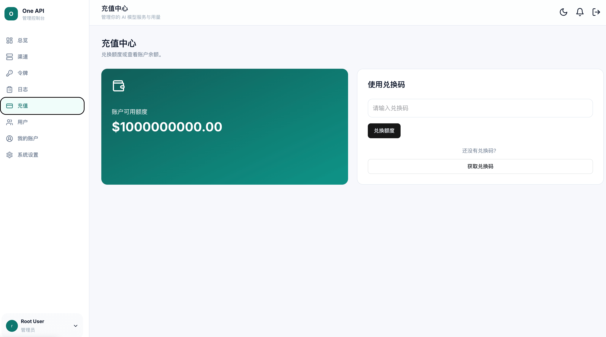
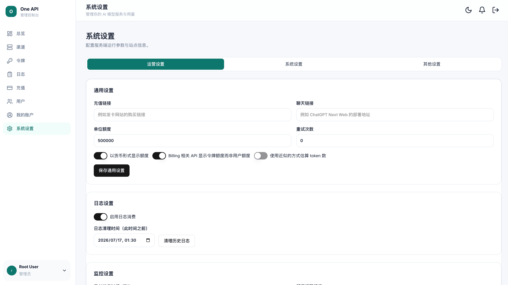

# One API Web

基于 **Vite + React + TypeScript + Tailwind CSS** 构建的 One API 管理控制台前端，提供模型渠道、访问令牌、用量日志、用户与系统配置的统一管理界面。

## 界面预览

### 登录页


### 仪表盘总览



### 令牌管理



## 技术栈

| 类别 | 技术 |
|------|------|
| 构建工具 | Vite 7、TypeScript 5.7 |
| UI 框架 | React 18、Tailwind CSS 3 |
| 状态管理 | Jotai（`atomWithStorage` 持久化） |
| 路由 | React Router 6（`createBrowserRouter`） |
| 表单 | React Hook Form + Yup / Zod |
| 组件库 | Radix UI 原语、lucide-react 图标 |
| 图表 | ApexCharts 6 + react-apexcharts |
| 国际化 | i18next |
| 测试 | Vitest |

## 功能特性

- **认证与授权**：用户名密码登录、OAuth（GitHub / 飞书 / OIDC）、Turnstile 人机校验、401 自动登出、角色权限边界（普通用户 / 管理员 / 超级管理员）
- **仪表盘**：额度、请求数与 Token 用量统计，折线图与柱状图可视化，模型维度筛选
- **渠道管理**：渠道增删改查、测速、类型动态表单、启用状态与优先级调整
- **令牌管理**：令牌增删改、额度编辑、过期时间、复制 `sk-` 密钥、启用/禁用切换
- **日志查询**：管理员全量 / 普通用户仅本人，多条件筛选与分页，消耗统计
- **用户管理**：用户增删改、额度调整、启用/禁用、管理员提升与降级
- **兑换码**：生成、批量下发、状态追踪与删除
- **充值与邀请**：兑换码充值、邀请码推广
- **系统设置**：运营 / 系统 / 其他三类配置分 Tab 管理
- **个人中心**：资料编辑、密码修改、开发者令牌展示
- **主题与响应式**：亮暗主题切换并持久化，桌面 / 移动端自适应布局

## 快速开始

### 环境要求

- Node.js ≥ 20（推荐使用仓库 `.nvmrc` 指定的版本）
- pnpm

### 安装依赖

```bash
pnpm install
```

### 启动开发服务器

```bash
pnpm dev
```

默认监听 `http://127.0.0.1:3090`，`/api` 请求自动代理到后端服务。

### 构建

```bash
pnpm build
```

### 类型检查

```bash
pnpm typecheck
```

### 运行测试

```bash
pnpm test
```

## 环境配置

| 变量 | 说明 | 默认值 |
|------|------|--------|
| `VITE_API_PROXY_TARGET` | 开发环境后端代理目标地址 | `http://127.0.0.1:3067` |

开发环境下 `/api/*` 请求通过 Vite 代理转发至后端，生产环境由网关或 Nginx 统一转发。

## 目录结构

```
src/
├── api/               # API 请求层与类型定义
├── common/            # 通用类型与工具
├── components/        # 通用组件（守卫、空态、表格骨架等）
├── hooks/             # 自定义 Hook
├── layout/            # 面板布局与导航
├── librechat-client/  # UI 基础组件库（按钮、对话框、Toast 等）
├── locales/           # 国际化资源
├── pages/             # 页面组件
│   ├── auth/          # 登录、注册、OAuth 回调
│   ├── channel/       # 渠道管理
│   ├── dashboard/     # 仪表盘
│   ├── log/           # 日志
│   ├── profile/       # 个人中心
│   ├── token/         # 令牌管理
│   └── user/          # 用户管理
├── routes/            # 路由配置
├── store/             # Jotai 全局状态
└── utils/             # 工具函数与权限判断
```
